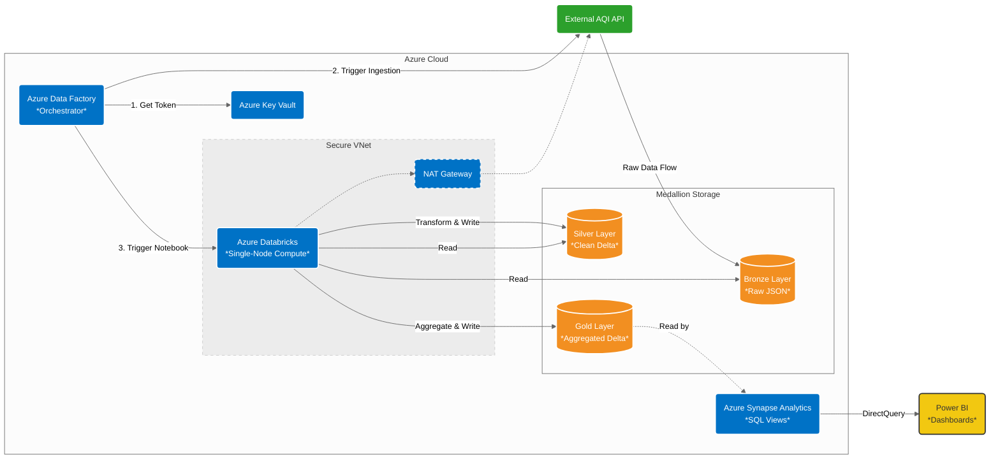

## 📌 Project Overview
This project is an end-to-end data engineering and analytics pipeline built on Microsoft Azure. It automates the ingestion, storage, transformation, and visualization of real-time Air Quality Index (AQI) data via a REST API. The pipeline implements a **Medallion Architecture** (Bronze, Silver, Gold) to progressively refine the data, ultimately serving it to business users through Azure Synapse and Power BI.

## 🏗️ Architecture & Tech Stack

* **Orchestration:** Azure Data Factory (ADF)
* **Compute / Transformation:** Azure Databricks (PySpark)
* **Storage:** Azure Data Lake Storage Gen2 (ADLS Gen2)
* **Data Serving / Warehousing:** Azure Synapse Analytics (Serverless SQL Pools)
* **Visualization:** Power BI
* **Security & Secrets:** Azure Key Vault, Managed Identities (System-Assigned)
* **Version Control / CI/CD:** Git (SourceTree/GitHub) with automated `adf_publish` branch management

### 📊 Architecture Diagram

## ⚙️ Data Flow 
1. **Ingestion (Bronze):** An ADF pipeline retrieves the API key securely from Azure Key Vault, then uses a Copy Data activity to pull raw JSON data from the AQI REST API and lands it into the ADLS Gen2 Bronze container.
2. **Cleansing (Silver):** An ADF Databricks Notebook Activity triggers a PySpark cluster to read the raw JSON, flatten nested structures, handle missing values, and enforce schema before writing to the Silver container as Delta tables.
3. **Aggregation (Gold):** A final PySpark notebook aggregates the clean data (e.g., daily AQI averages, geographical grouping) to prepare it for business intelligence tools.
4. **Serving (Synapse & Power BI):** Azure Synapse Analytics connects to the Gold container. Serverless SQL views are created on top of the Delta tables, providing a logical data warehouse layer. Power BI then connects to these Synapse views to build interactive dashboards visualizing air quality trends.

## 🛠️ Technical Challenges Overcome
This project was built to simulate real-world, enterprise-level constraints and security requirements:

* **End-to-End Analytics Integration:** Bridged the gap between Data Lakehouse storage (Delta tables) and BI reporting by configuring Azure Synapse Serverless SQL pools to create performant views for Power BI.
* **Resource Quota Management:** Successfully designed and deployed the Spark compute environment within a strict 10-vCPU regional quota by configuring a customized Single-Node Databricks cluster (`Standard_DS3_v2`) using dynamic JSON expressions to bypass UI limitations.
* **Secure Networking & Outbound Connectivity:** Implemented Secure Cluster Connectivity (No Public IP) with VNet injection. To enable the private compute nodes to successfully reach the public AQI REST API, I provisioned and associated an Azure NAT Gateway to the private subnets.
* **Complex CI/CD & Git Synchronization:** Managed ADF code deployments by resolving complex, unrelated commit history conflicts between local development branches and the main repository using Git CLI tools, ensuring seamless generation of ARM templates in the `adf_publish` branch.
* **IAM & Security:** Enforced the principle of least privilege using Azure Key Vault backed by secret scopes and System-Assigned Managed Identities (RBAC) to eliminate hardcoded credentials across all services.

## 🚀 How to Run the Pipeline
1. Clone the repository: `git clone https://github.com/nahushamane/aqi-azure-data-engineering.git`
2. Set up the Azure resources (ADF, Databricks, ADLS Gen2, Key Vault).
3. Add your AQI API Key to Azure Key Vault as a secret named `api-key`.
4. Import the Databricks notebooks (`/notebooks/`) to your workspace.
5. In ADF, connect your GitHub repository to sync the Linked Services, Datasets, and Pipelines.
6. Trigger the `pl_ingest_aqi_data` pipeline in ADF.
7. Execute the Synapse SQL scripts (`/sqlscript/`) to create views over the Gold layer.
8. Connect Power BI to the Synapse workspace endpoint and open the `.pbix` file.

## 👤 Author
**[Nahush Amane]**
* LinkedIn: [(https://www.linkedin.com/in/nahushamane/)]